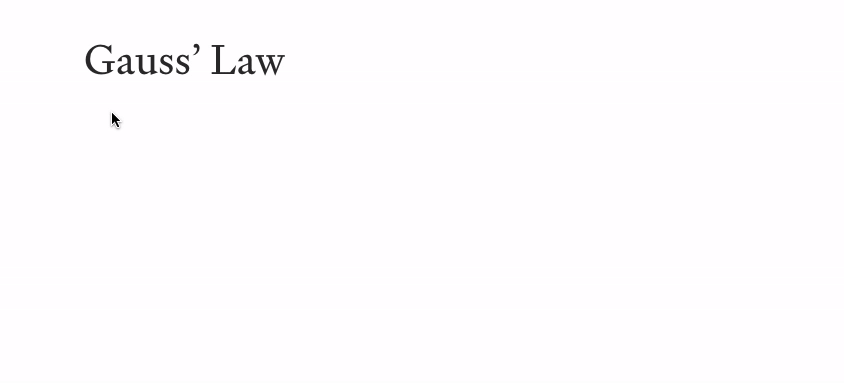

  <svg width="96" height="96" style="background-color: black">
    <path fill="white" d="M22.5,16.4l0.1,2l24.4,30.4L22.2,78.2L22.2,80L70,79.8c0.5-5.9,1.7-12,2.8-17.9l-1.6-0.4
    c-1.4,3.3-2.5,6.8-5.6,8.9c-3.4,2.4-7.9,2.1-11.8,2.1h-22l22.4-27.1L34.1,20.1l11.8,0c7.6,0,18.3-1.8,21.3,7.3
    c0.5,1.6,0.9,3.2,1,4.8h1.7l-1.3-15.7H22.5L22.5,16.4L22.5,16.4L22.5,16.4L22.5,16.4z" />
  </svg>
   
   
  <strong>Median</strong>
   
  Browser extension that brings LaTeX to Medium.

