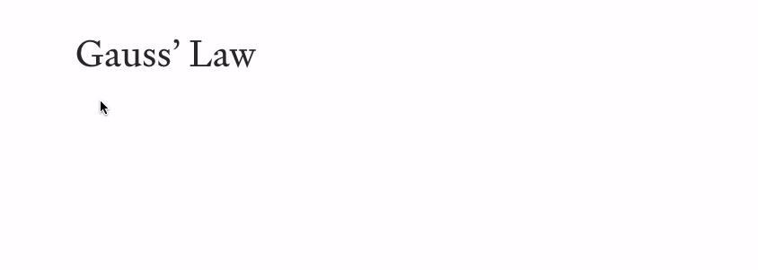

<p align="center">
  
  <br />
  <strong>Median</strong>
  <br />
  <span>Browser extension that brings LaTeX to Medium.</span>
</p>



# Installation

- [Get the Chrome extension](https://chrome.google.com/webstore/detail/median/anceofoolakbkhkpmkajcflfhjadmahp)
- [Get the Firefox add-on](https://addons.mozilla.org/en-US/firefox/addon/median/)

# How it works

The extension sends a request to [QuickLaTeX](https://www.quicklatex.com/), a web service that allows you to typeset LaTeX with a simple API request. An image URI is returned, which is then fetched and transformed into a File. This File object is used to simulate a drop event in the Medium editor.

# Building

Running

```
node ./build.js ./build
```

produces a `Median.zip` file in the `build/` directory.
